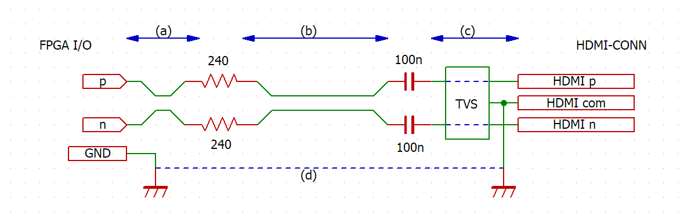
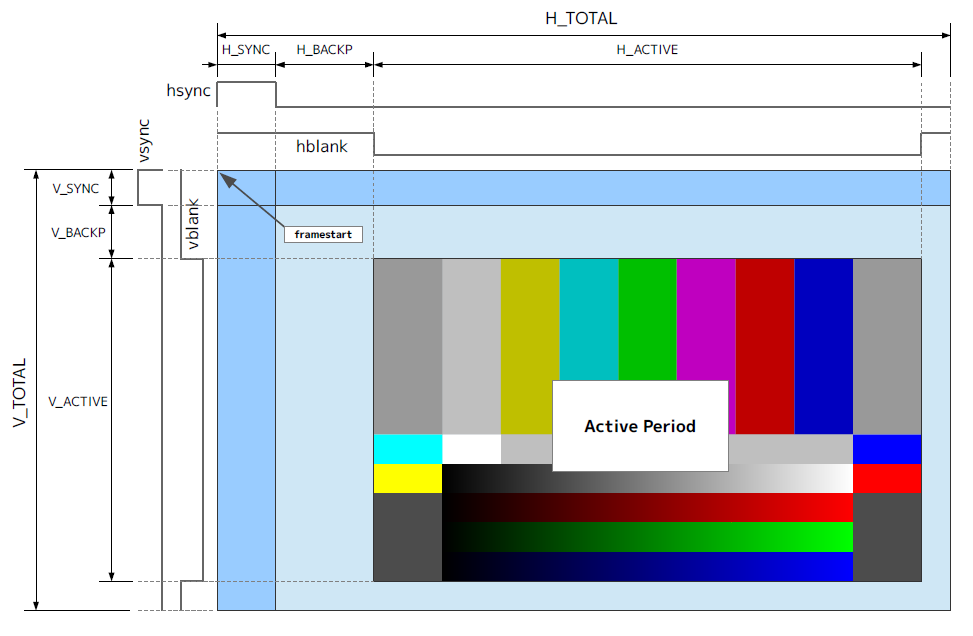
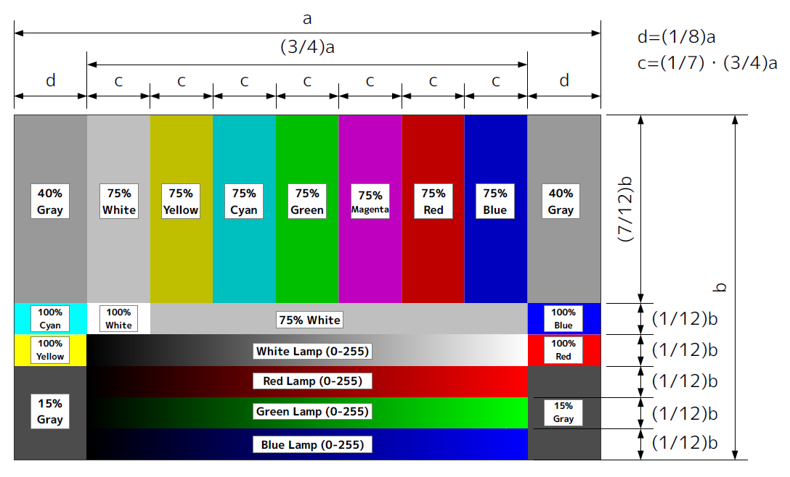
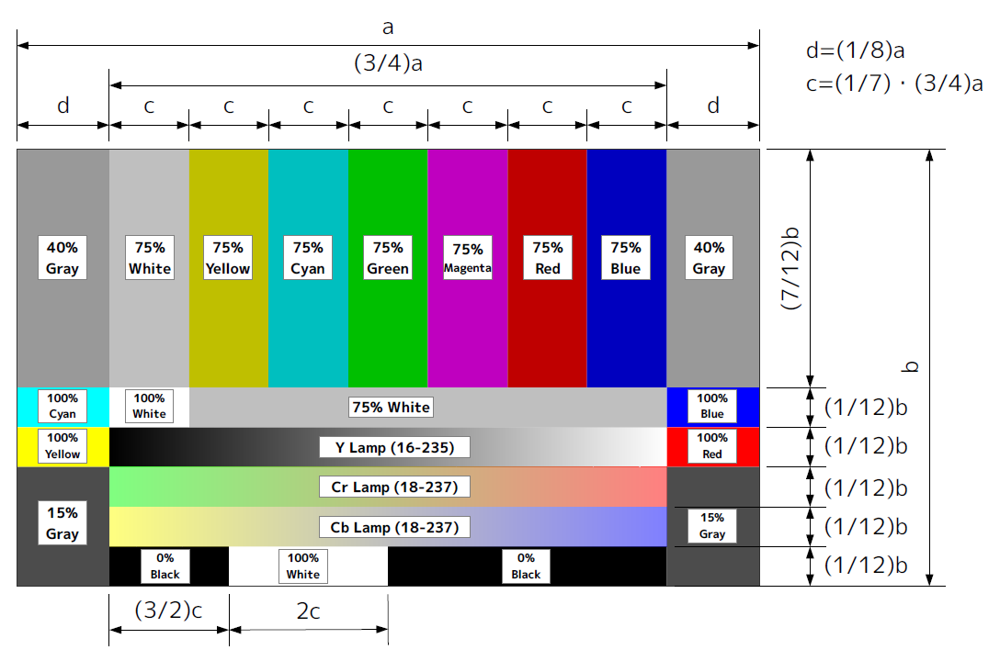

# ローエンドFPGA向け HDMI-TX IPコア

Intel FPGAおよびGowin FPGAのローエンドデバイスファミリ向けHDMI-TXコアおよびVideo同期信号生成コアです。  

- **環境**
	- Intel FPGA : Quartus Prime 20.1以降
	- Gowin FPGA : Gowin EDA 1.9.8以降

- **HDMI-TXコア**
	- 24bitカラー入力 (RGB888またはYCbCr444)
	- ACTIVE(DE),HSYNC,VSYNC入力からHDMIの各種信号を復元
	- 同期信号極性選択可能
	- 色空間設定対応 (RGB/BT.601 YCbCr/BT.709 YCbCr/xvYCC.601/xvYCC.709)
	- スキャンモード指定対応 (オーバースキャン/アンダースキャン)
	- コンテンツモード指定対応 (Graphics/Photo/Cinema/Game)
	- オーディオストリーム対応 (32KHz～192KHz,24bit 2chステレオ)
	- DVIおよび縮小HDMIエンコード対応
	- コンパクトロジック (オーディオストリーム実装時 970LE+2M9k)
	- 最大解像度HD720p (fmaxに依存)
	- LVDSまたは疑似差動LVCMOS出力に対応
	- Intel FPGA(MAX 10, Cyclone III, Cyclone IV, Cyclone V, Cyclone 10LP)、Gowin FPGA(GW1N, GW2A)に対応

- **Video同期信号生成コア**
	- 任意の解像度のビデオ同期信号およびARIBライクなカラーバー信号を生成
	- カラーバーはHDTV用(16:9)とSDTV用(4:3)のパターンを選択可能
	- RGB(Full range)およびBT.601/BT.709のYCbCr(Limited range)を選択可能
	- ビデオ信号用にVSYNC, HSYNC, CSYNC, V-Blank, H-Blank, Active信号を生成
	- フレームバッファ制御用にframetop, linestart, pixelrequest信号を生成

# License

MIT License

**!! NOTICE !!**  
This source code does not include HDMI license.  
When developing and selling HDMI equipment products, it is necessary to become a member of HDMI Licensing Administrator, Inc.  
[https://www.hdmi.org/](https://www.hdmi.org/)  

- 本ソースコードにはHDMIのライセンスは含まれません。HDMI機器製品を開発・販売する際にはHDMI Licensing Administrator, Inc.のアダプターメンバーになる必要があります。
- 本ソースコードは研究・実験目的で公開されており、本ソースコードを直接あるいは間接的に利用した事ないし利用した物で発生した全ての問題に対し、本ソースコードの製作者および権利者は一切の責務を負いません。

# 1. 使い方

1. `/hdl`以下の`hdmi_tx.vhd`(Intel用)または`hdmi_tx_ge.vhd`(Gowin用)をプロジェクトに追加します。  
1. 次のようにインスタンスします。  
	**Verilogの例**
	```verilog
	hdmi_tx #(
	    .DEVICE_FAMILY      ("MAX 10"),
	    .CLOCK_FREQUENCY    (VGACLOCK_MHZ),
	    .AUDIO_FREQUENCY    (FSCLOCK_KHZ)
	)
	u_tx (
	    .reset      (reset_sig),
	    .clk        (vga_clk_sig),
	    .clk_x5     (tx_clk_sig),

	    .active     (active_sig),
	    .r_data     (r_sig),
	    .g_data     (g_sig),
	    .b_data     (b_sig),
	    .hsync      (hsync_sig),
	    .vsync      (vsync_sig),

	    .pcm_fs     (pcm_fs_sig),
	    .pcm_l      (pcm_ldata_sig),
	    .pcm_r      (pcm_rdata_sig),

	    .data       (TMDS_DATA),
	    .data_n     (TMDS_DATA_N),
	    .clock      (TMDS_CLOCK),
	    .clock_n    (TMDS_CLOCK_N)
	);
	```

	**VHDLの例** (コンポーネント宣言は`hdmi_tx.vhd`の先頭コメントを参照)
	```vhdl
	u_tx : hdmi_tx
	generic map (
	    DEVICE_FAMILY   => "MAX 10",
	    CLOCK_FREQUENCY => VGACLOCK_MHZ,
	    AUDIO_FREQUENCY => FSCLOCK_KHZ
	)
	port map (
	    reset   => reset_sig,
	    clk     => vga_clk_sig,
	    clk_x5  => tx_clk_sig,

	    active  => active_sig,
	    r_data  => r_sig,
	    g_data  => g_sig,
	    b_data  => b_sig,
	    hsync   => hsync_sig,
	    vsync   => vsync_sig,

	    pcm_fs  => pcm_fs_sig,
	    pcm_l   => pcm_ldata_sig,
	    pcm_r   => pcm_rdata_sig,

	    data    => TMDS_DATA,
	    data_n  => TMDS_DATA_N,
	    clock   => TMDS_CLOCK,
	    clock_n => TMDS_CLOCK_N
	);
	```

	Video同期信号生成コアとの組み合わせについてはexampleを参照してください。


# 2. モジュールインターフェース

## 2.1 hdmi_tx Module interface

|Signal|Width|Direction|Description|
|---|:---:|:---:|---|
|reset|1|in|コアの非同期リセット入力です。`'1'`でリセットアサートします。|
|clk|1|in|コアのクロック入力です。全ての入力は立ち上がりエッジでラッチされます。|
|clk_x5|1|in|シリアライザロック入力です。`clk`に同期した5倍のクロックを入力します。`clk`と`clk_x5`の位相は0 degで、同一のPLLから供給します。|
|control|4|in|外部からHDMIタイミング制御を行う場合に使用します。`USE_EXTCONTROL="ON"`の場合のみ有効です。DVIの場合は参照しません。使用しない場合は未接続にします。|
|active|1|in|ビデオアクティブ期間の入力信号です。`USE_EXTCONTROL="OFF"`の場合に有効です。使用しない場合は未接続にします。|
|r_data|8|in|色空間がRGBの場合はR、色差の場合はCrのデータ入力です。|
|g_data|8|in|色空間がRGBの場合はG、色差の場合はYのデータ入力です。|
|b_data|8|in|色空間がRGBの場合はB、色差の場合はCbのデータ入力です。|
|hsync|1|in|水平同期信号入力です。同期信号は正論理の信号を入力します。|
|vsync|1|in|垂直同期信号入力です。同期信号は正論理の信号を入力します。|
|pcm_fs|1|in|PCM信号のサンプリングクロックを入力します。立ち上がりエッジから`clk`で6クロックの間はサンプリングデータを固定してください。|
|pcm_l|24|in|左チャネルのサンプリングデータです。符号付き24bit整数で入力します。|
|pcm_r|24|in|右チャネルのサンプリングデータです。符号付き24bit整数で入力します。|
|data|3|out|TMDSデータチャネルのシリアライズ出力です。出力ピンに配置してください。|
|data_n|3|out|`data`の反転出力です。疑似差動を使う場合はペアピンに配置してください。このポートはIntel FPGAのみです。|
|clock|1|out|TMDSクロックチャネルのシリアライズ出力です。出力ピンに配置してください。|
|clock_n|1|out|`clock`の反転出力です。疑似差動を使う場合はペアピンに配置してください。このポートはIntel FPGAのみです。|

## 2.2 hdmi_tx Parameters
|Parameter|Legal<br />values|Default<br />values|Description|
|---|---|---|---|
|DEVICE_FAMILY|"MAX 10"<br>"Cyclone 10 LP"<br>"Cyclone V"<br>"Cyclone IV E"<br>"Cyclone IV GX"<br> "Cyclone III"|"Cyclone III"|インスタンスするFPGAファミリを指定します。このパラメーターはIntel FPGAのみです。|
|CLOCK_FREQUENCY|25.0 - 148.5|25.2|`clk`ポートに入力するクロックの周波数を`MHz`で与えます。パケットスケジュールリングに参照されるため、正確なクロック数を入力してください。|
|ENCODE_MODE|"HDMI"<br>"LITEHDMI"<br>"DVI"|"HDMI"|エンコードモードを指定します。<br>`"LITEHDMI"`はNullパケットのみの送信をおこなう縮小HDMIトランスミッタです。|
|USE_EXTCONTROL|"ON"<br>"OFF"|"OFF"|HDMIモードのときに外部コントロールを使うかどうか指定します。外部コントロールを使う場合、active信号からのタイミング再生を行わないため省リソースになります。|
|SYNC_POLARITY|"POSITIVE"<br>"NEGATIVE"|"NEGATIVE"|送出する同期信号の極性を指定します。|
|SCANMODE|"AUTO"<br>"OVER"<br>"UNDER"|"AUTO"|HDMIシンク機器へスキャンモードの情報を与えます。<br>`"AUTO"`:シンク機器側で判断<br>`"OVER"`:オーバースキャン<br>`"UNDER"`:アンダースキャン|
|PICTUREASPECT|"NONE"<br>"4:3"<br>"16:9"|"NONE"|HDMIシンク機器へ画像のアスペクト比情報を与えます。<br>`"NONE"`:情報なし<br>`"4:3"`:アスペクト比4:3<br>`"16:9"`:アスペクト比16:9|
|FORMATASPECT|"AUTO"<br>"4:3"<br>"16:9"<br>"14:9"|"AUTO"|HDMIシンク機器へ映像出力のアスペクト比情報を与えます。<br>`"AUTO"`:シンク機器側で判断<br>`"4:3"`:出力モード4:3<br>`"16:9"`:出力モード16:9<br>`"14:9"`:出力モード14:9|
|PICTURESCALING|"FIT"<br>"HEIGHT"<br>"WIDTH"<br>"NONE"|"FIT"|HDMIシンク機器へ映像出力のスケーリング情報を与えます。<br>`"FIT"`:映像出力に合わせる<br>`"HEIGHT"`:高さに合わせる<br>`"WIDTH"`:幅に合わせる<br>`"NONE"`:スケーリング情報なし|
|COLORSPACE|"RGB"<br>"BT601"<br>"BT709"<br>"XVYCC601"<br>"XVYCC709"|"RGB"|HDMIシンク機器へビデオデータの色空間情報を与えます。<br>`"RGB"`:RGB888(Fullscale)<br>`"BT601"`:YCbCr444(ITU-R BT.601/SMPTE170M)<br>`"BT709"`:YCbCr444(ITU-R BT.709)<br>`"XVYCC601"`:YCbCr444(xvYCC BT.601)<br>`"XVYCC709"`:YCbCr444(xvYCC BT.709)|
|YCC_DATARANGE|"LIMITED"<br>"FULL"|"LIMITED"|色空間がYCbCrの場合にデータ範囲を示唆します。|
|CONTENTTYPE|"GRAPHICS"<br>"PHOTO"<br>"CINEMA"<br>"GAME"|"GRAPHICS"|HDMIシンク機器へ映像コンテンツタイプを与えます。<br>`"GRAPHICS"`:PCグラフィックス<br>`"PHOTO"`:写真・静止画<br>`"CINEMA"`:映画<br>`"GAME"`:ゲーム機器|
|REPETITION|0 - 10|0|ピクセルリピテーションの値を指定します。詳しくはCEA-861-Dを参照してください。|
|VIDEO_CODE|0 - 127|0|ビデオコードの値を指定します。詳しくはCEA-861-Dを参照してください。|
|USE_AUDIO_PACKET|"ON"<br>"OFF"|"ON"|オーディオストリームを使うかどうか指定します。|
|AUDIO_FREQUENCY|32.0, 44.1, 48.0, 88.2, 96.0, 176.4, 192.0|44.1|PCMサンプリング周波数を`kHz`で指定します。|
|PCMFIFO_DEPTH|8, 9, 10|8|サンプリングデータFIFOの深さを指定します。|
|CATEGORY_CODE||"00000000"|ソース機器のカテゴリ情報を設定します。詳しくはIEC60958-3を参照してください。|

## 2.3 video_syncgen Module interface

|Signal|Width|Direction|Description|
|---|:---:|:---:|---|
|reset|1|in|コアの非同期リセット入力です。`'1'`でリセットアサートします。|
|video_clk|1|in|コアのクロック入力です。全ての入力は立ち上がりエッジでラッチ、出力されます。|
|scan_ena|1|in|スキャンイネーブル入力です。VSYNC開始のタイミングでサンプリングされ、`'1'`の場合にはそのフレームのアクティブライン開始およびピクセルリクエストが出力されます。|
|framestart|1|out|フレーム先頭開始信号出力です。1クロックパルスまたはHSYNC幅の信号が出力されます。|
|linestart|1|out|アクティブライン開始信号出力です。1クロックパルスまたはHSYNC幅の信号が出力されます。|
|pixrequest|1|out|ピクセルリクエスト信号出力です。`EARLY_REQ`パラメーターで指定クロック分先行させることができます。|
|hdmicontrol|4|out|hdmi_tx用のHDMIコントロール信号出力です。|
|active|1|out|ビデオアクティブ信号です。アクティブ期間の間`'1'`が出力されます。|
|hsync|1|out|水平同期信号です。正論理で出力されます。|
|vsync|1|out|垂直同期信号です。正論理で出力されます。|
|csync|1|out|複合同期信号です。正論理で出力されます。|
|hblank|1|out|水平ブランク信号です。ブランク期間の間`'1'`が出力されます。|
|vblank|1|out|垂直ブランク信号です。ブランク期間の間`'1'`が出力されます。|
|cb_rout|8|out|カラーバーのR出力です。色空間がBT601/709の場合はCrになります。|
|cb_gout|8|out|カラーバーのG出力です。色空間がBT601/709の場合はYになります。|
|cb_bout|8|out|カラーバーのB出力です。色空間がBT601/709の場合はCbになります。|

※カラーバーの映像出力は`pixrequest`のタイミングで行われます。

## 2.4 video_syncgen Parameters

|Parameter|Legal<br />values|Default<br />values|Description|
|---|---|---|---|
|BAR_MODE|"WIDE"<br>"SD"|"WIDE"|カラーバーの出力モードを指定します。<br>`"WIDE"`:16:9用のカラーバーを出力<br>`"SD"`:4:3用のカラーバーを出力|
|COLORSPACE|"RGB"<br>"BT601"<br>"BT709"|"RGB"|カラーバーの色空間を指定します。<br>`"RGB"`:RGB888 Full range<br>`"BT601"`:ITU-R BT.601 YCbCr Limited range<br>`"BT709"`:ITU-R BT.709 YCbCr Limited range|
|START_SIG|"SINGLE"<br>"WIDTH"|"SINGLE"|`framestart`、`linestart`の信号出力幅を指定します。<br>`"SINGLE"`:`video_clk`で1クロック幅の信号<br>`"WIDTH"`:HSYNC幅の信号|
|EARLY_REQ|0 - 16|0|`pixrequest`のアサートタイミングを`active`からいくつ早めるかを指定します。ピクセルデータ読み出しのパイプライン分の遅延補償のために使用します。|
|H_TOTAL|1 - 4096||水平トータルピクセル数(クロック数)です。|
|H_SYNC|1 - 1024||水平同期信号のピクセル数(クロック数)です。|
|H_BACKP|0 - 1024||水平バックポーチのピクセル数(クロック数)です。|
|H_ACTIVE|1 - 4096||水平ビデオアクティブ期間のピクセル数(クロック数)です。|
|V_TOTAL|1 - 4096||垂直トータルライン数です。|
|V_SYNC|1 - 1024||垂直同期信号のライン数です。|
|V_BACKP|0 - 1024||垂直バックポーチのライン数です。|
|V_ACTIVE|1 - 4096||垂直ビデオアクティブ期間のライン数です。|
|FRAME_TOP||0|外部同期時に使用するオプションです。|
|START_HPOS||0|外部同期時に使用するオプションです。|
|START_VPOS||0|外部同期時に使用するオプションです。|

# 3. 技術情報

## 3.1 FPGAピン配置のガイドライン

hdmi_txモジュールはTMDS信号出力用にシリアライザを内蔵しています。シリアライザは `clk` と同期した5倍の送信用クロック `clk_x5` で駆動されるDDR出力回路によって、ビデオクロックの10倍のビットレートを出力します。  
そのため、TMDS信号を出力する `data[2:0]`、`data_n[2:0]`、`clock` および `clock_n` ポートはトップエンティティのピン出力に接続しなければなりません。トップエンティティまで複数のモジュール階層に渡る場合、それぞれのモジュールでポートを接続し、途中に不要な回路が入らないよう注意してください。  

TMDS信号を配置するFPGAピンには、IOブロックにDDRIOが配置された高速I/Oピンを指定します。以下のピンには配置できません。  
- ❌ 高速I/O出力に対応していないピン（VREF、CLK、AIN等）
- ❌ コンフィグレーションで使用される、またはコンフィグレーション機能が割り当てられているピン
- ❌ DDRIO機能が無いピン
- ❌ 3.3V-LVCMOS または 2.5V-CMOS が使えないピン

疑似差動出力では `data[x]` と `data_n[x]`、`clock` と `clock_n` のペアがそれぞれ揃ったスキューで動作する必要があります。配置するピンは以下を推奨します。
- ✅ LVDSペア同士のピン
- ✅ 同一DQSグループ内のDQピン
- ✅ 同一バンク内で隣接している、または近い場所にあるDDRIO機能ピン

また既存ボードを使用して実装を行う場合はピンの組み合わせよりも基板上の配線品質（隣接配線、長さの揃っている配線、viaで層間移動の無いあるいは可能な限り少ない配線、GND還流が阻害されない配線など）を重視してください。信号ペア間が大きく離れるような配線は使用できません。LVDSが使用できるようなペアパターンがあればそこを使うのが望ましいでしょう。

LVDS出力で使用する場合は `data[2:0]` および `clock` の4本のみをピンに配置し `data_n[2:0]`、`clock_n` は未接続にします。  


## 3.2 疑似差動TMDSのガイドライン

FPGA I/Oピンからコネクターまでのアートワークは以下の点に注意してください。  


- **(a) FPGAピンからダンピング抵抗まで**  
	220Ωまたは240Ωのダンピング抵抗は極力ピンのそばに配置するようにします。既存ボードの拡張端子などを使う場合は端子ピンの直近に配置します。パッドや配線でペアの平衡が崩れないよう、p側/n側の対称性を心がけた配置をしてください。
- **(b) ダンピング抵抗からDCカットキャパシタまで**
	FPGAとコネクターの間が離れている場合、ここのラインを延長します。配線はかならずペア配線となるように引き回し、viaによる層間移動やノイズ源（特にDC/DCコンバーターなどのインダクタノイズ）の干渉が少なくなるよう注意してください。
- **(c) コネクター周辺**
	DCカットキャパシタおよびTVS保護素子はコネクター直近に配置するようにします。キャパシタやTVSの配線でもペア配線の対称性を心がけた配置をしてください。コネクターのコモンGND(ペア配線の共通GND)は必ず全て結線し、信号ラインの直近を流れるGND配線に接続します。
- **(d) 還流GND**
	TMDSは電流モードの信号のため還流用にコモン信号線が必要です。通常この信号線にはGNDが使われます。そのため、コネクターGNDからFPGA I/OのGNDへの配線はペア信号の直近を通るインピーダンスの低いラインが必要です。GNDが分断されていたり大きく迂回するような配線は避けるようにします。

より詳細なアートワークについては各社で公開されている高速差動回路の基本的な資料を参照してください。
- [TI LVDSオーナーズ・マニュアル Part1](https://www.ti.com/jp/lit/ml/jaja441/jaja441.pdf)
- [TI LVDSオーナーズ・マニュアル Part2](https://www.ti.com/jp/lit/ug/jaja442/jaja442.pdf)


## 3.3 ビデオ信号タイミング

video_syncgenモジュールのパラメーターと同期信号タイミングは以下のようになります。  


カラーバーはARIB STD-B.28のマルチフォーマットカラーバーを元にランプ領域を追加しています。領域サイズと配色を次に示します。  
カラーバー各領域は、横サイズ(a)は`H_ACTIVE`パラメーター、縦サイズ(b)は`V_ACTIVE`パラメーターの値を元に計算されます。SDモードの場合は、両端のd部分がカットされ中央の3/4部分のみが表示されます。  
- **RGB**  
	

- **BT601/BT709**  
	


---
©︎ 2023 J-7SYSTEM WORKS LIMITED.
